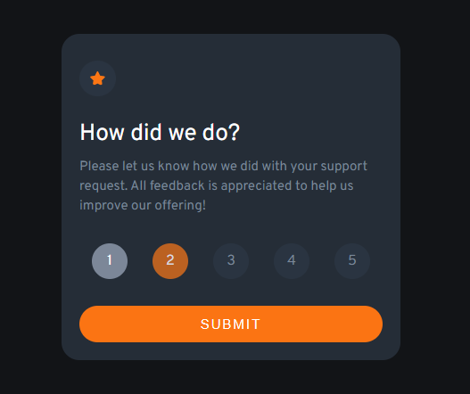

# Frontend Mentor - Interactive rating component

Your challenge is to build out this interactive rating component and get it looking as close to the design as possible.

### Considerações/Aprendizados:

Incrível realizar mais esse projeto, realmente tem uma diferença entre a teoria e a prática kk, preciso melhorar muito a minha lógica ainda, mas é um processo, e uma hora vai dá bom 😎
## Resultado do projeto:
